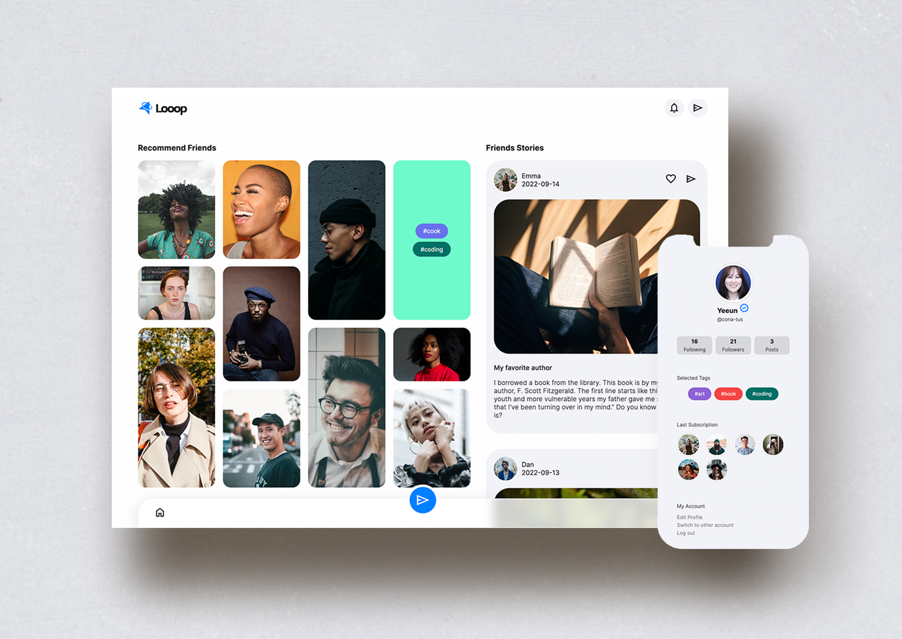
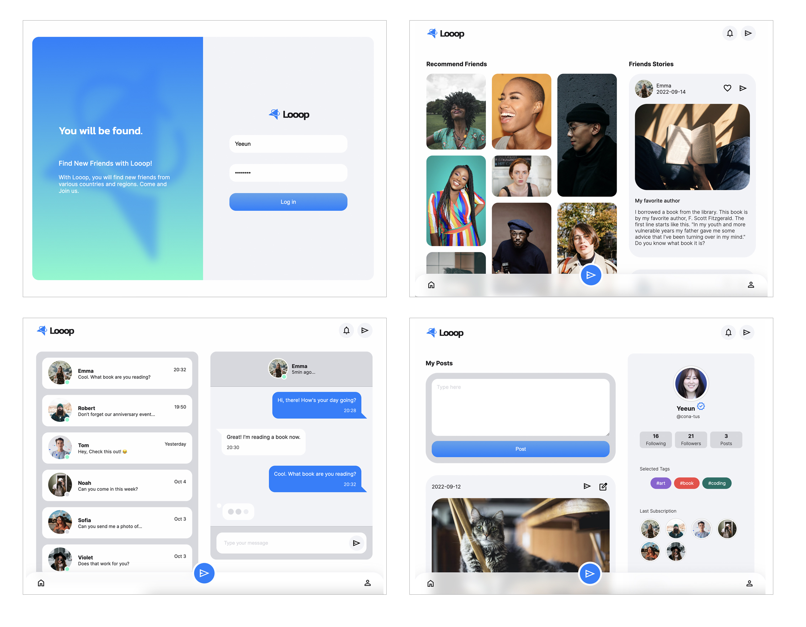
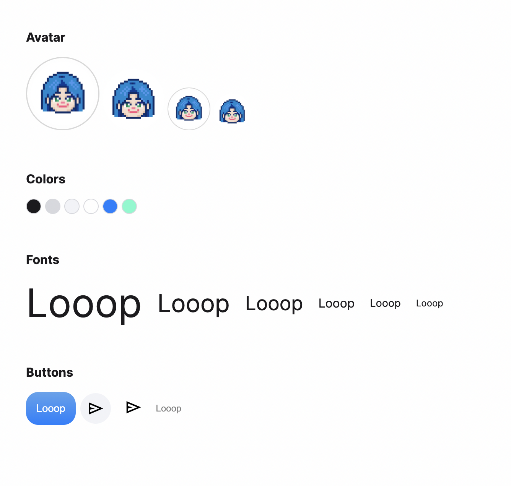

# 소셜 미디어 앱, 루프



[](https://app.netlify.com/sites/conatus-looop/deploys)

By [cona-tus](https://github.com/cona-tus) | [Demo](https://conatus-looop.netlify.app/)

<br/>

---

<br/>

## 📌 개요

### 1. 프로젝트 설명

본 프로젝트는 HTML과 CSS만을 사용한 정적인 애플리케이션입니다. 소셜 미디어 앱인 루프<i>Looop</i>는 자신의 관심 태그를 설정하면 친구 추천을 반복적으로 받을 수 있다는 컨셉으로 제작하였습니다. 웹과 모바일 등 다양한 디바이스에 반응형으로 작동합니다.

### 2. 제작 기간 & 참여 인원

- 2022-10-26 ~ 2022-11-5
- 개인 프로젝트 (1인)

<br/>

## 🛠 사용 기술

- ?style=flat&logo=HTML5&logoColor=ffffff>)
- ?style=flat&logo=css3&logoColor=ffffff>)
- 

<br/>

## 🖥 페이지 내용

- Login: 소개문과 로그인 페이지
- Home: 친구 추천과 블로그 포스팅 목록
- Chat: 친구 목록과 대화창
- Profile: 개인 블로그와 프로필 정보



<br/>

## 🎨 UI & 기능

### 1. 유연한 반응형 디자인

다양한 디바이스에 적용할 수 있도록 Flex box와 Grid를 활용하고, rem/em/% 단위를 사용하였습니다.


<br/>

### 2. 스타일 컴포넌트화

재사용 가능하도록 스타일 변수를 설정하고, 컴포넌트화하여 관리하였습니다.

```
Common
 ┣ box
 ┣ colors
 ┣ fonts
 ┗ reset

Components
 ┣ avatar
 ┣ buttons
 ┣ logo
 ┣ posts
 ┣ tags
 ┗ title

layouts
 ┣ header
 ┗ navbar
```



<br/>

## 🎯 프로젝트 후기

- W3C에서 제공하는 마크업 유효성 검사를 실행한 후 경고가 발생한 부분을 수정하였습니다. 이때 시맨틱 태그 중첩(section > main)에 오류가 있어 검색을 통해 해결했습니다.
- 디자인 시안과 정밀한 기획이 부족하여 UI를 그리는 데에 어려움을 겪었습니다. 특히 앱을 반응형으로 제작할 때 그리드 이미지를 여러 번 수정하여 시간을 꽤 소비했는데, 한편으로는 그리드 사용에 익숙해지도록 반복하는 좋은 경험이었다고 생각합니다.

<br/>
<br/>
