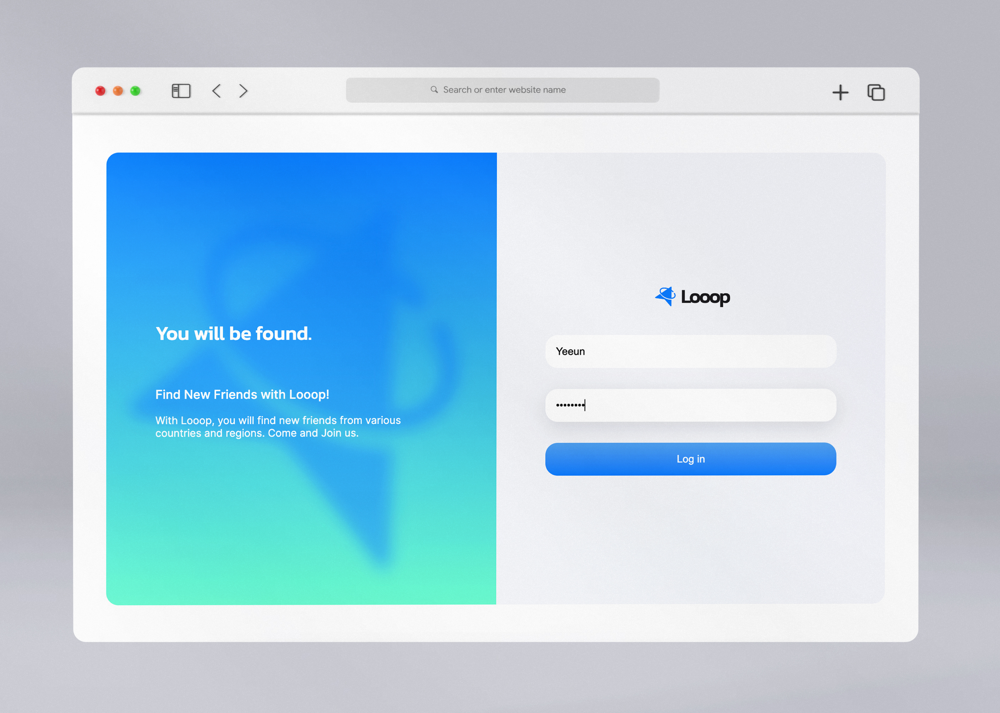
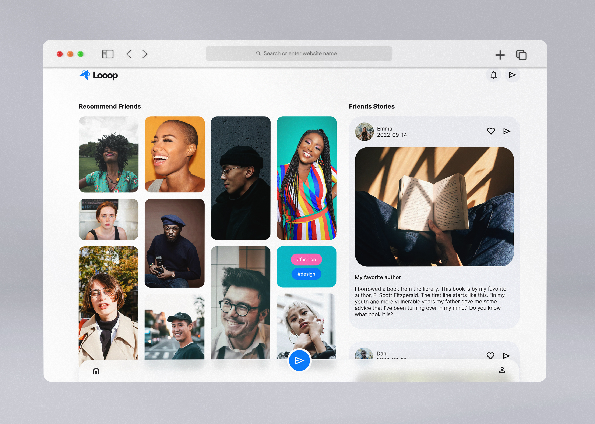
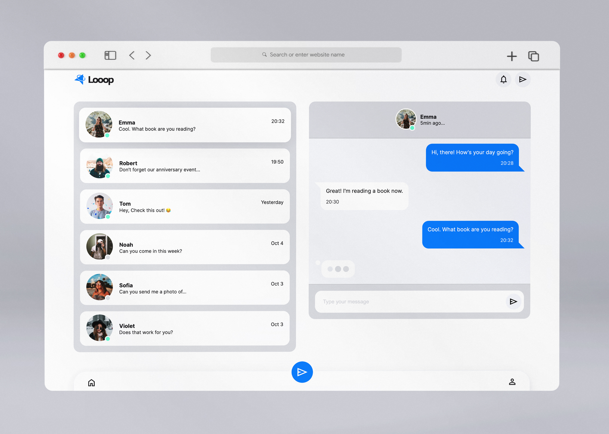
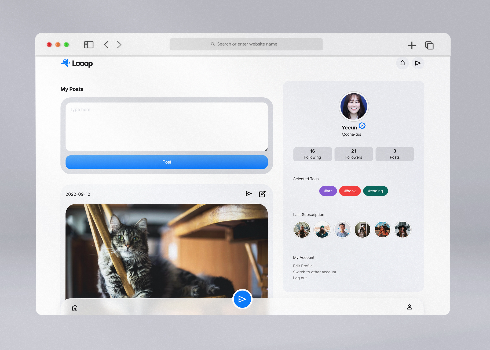

# 소셜 미디어 앱, 루프


[](https://app.netlify.com/sites/conatus-looop/deploys)

By [cona-tus](https://github.com/cona-tus) | [Demo](https://conatus-looop.netlify.app/)

<br/>

---

<br/>

## 📌 개요

### 1. 프로젝트 설명

본 프로젝트는 HTML과 CSS만을 사용한 정적인 애플리케이션입니다. 소셜 미디어 앱인 루프<i>Looop</i>는 자신의 관심 태그를 설정하면 친구 추천을 반복적으로 받을 수 있다는 컨셉으로 제작하였습니다. 웹과 모바일 등 다양한 디바이스에 반응형으로 작동합니다.

<br/>

### 2. 제작 기간 & 참여 인원

- 2022-10-26 ~ 2022-11-5
- 개인 프로젝트 (1인)

<br/>

## 🛠 사용 기술

- 
- 
- 

<br/>

## 🖥 페이지 내용

- Login: 소개문과 로그인 페이지



<br/>

- Home: 친구 추천과 블로그 포스팅 목록



<br/>

- Chat: 친구 목록과 대화창



<br/>

- Profile: 개인 블로그와 프로필 정보



<br/>

## 🎨 UI & 기능

### 1. 유연한 반응형 디자인

다양한 디바이스에 적용할 수 있도록 Flex box와 Grid를 활용하였습니다. 또한 고정된 px 단위 대신, 보다 유동적인 rem/em/% 단위를 사용하였습니다.


<br/>

### 2. 스타일 규격화

애플리케이션에 전체적인 통일감을 주고, 스타일 요소를 재사용할 수 있도록
스타일 변수를 설정하고 모듈화하여 관리했습니다.

- 폴더 구조

```
Common
 ┣ box
 ┣ colors
 ┣ fonts
 ┗ reset

Components
 ┣ avatar
 ┣ buttons
 ┣ logo
 ┣ posts
 ┣ tags
 ┗ title

layouts
 ┣ header
 ┗ navbar
```

<br/>

- 스타일 예시


<br/>

## 🎯 프로젝트 후기

- 시맨틱 태그의 사용과 오류  
  무분별한 div 태그 대신 상황에 따라 시맨틱 태그를 사용했습니다. 그런데 W3C에서 제공하는 마크업 유효성 검사를 실행하자 시맨틱 태그의 중첩에 오류가 있다는 것을 알게 되었습니다. body 하위 태그로 section을 사용하여 각 html 파일을 구분하려는 의도였는데, section 안에는 main 태그가 포함되지 않아야 했습니다. 이후 컨테이너 용도의 section 태그가 불필요하다 생각되어 이를 삭제하는 방식으로 해결했습니다.

- UI 디자인과 구현 과정  
  구체적인 디자인 시안을 마련하지 않아 UI를 구현하는 데에 어려움을 겪었습니다. 특히 앱을 반응형으로 제작할 때 페이지의 화면 분할과 Home의 이미지 그리드를 여러 번 수정하여 시간을 꽤 소비했다는 아쉬움이 남습니다. 개발 과정이 원활히 진행되기 위해서는 기획 단계에서 디자인의 방향성을 충분히 고민하고, 이를 어떻게 마크업할지 생각해보는 시간이 필요하다고 느꼈습니다.

<br/>
<br/>
